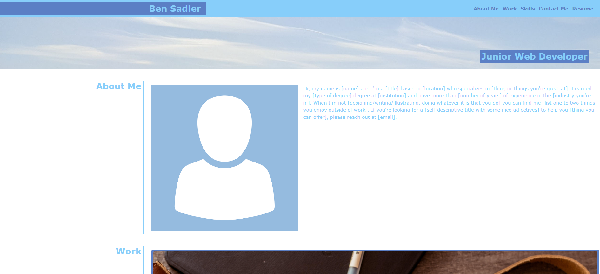

# Ben-Sadler-Portfolio-Bootstrap

## Description 

This project requires application of learning from front end web development course to reproduce a Portfolio webpage (ref Website: https://bena251.github.io/Ben-Sadler-Portfolio/) from scratch using Bootstrap. 

The project User Story & acceptance criteria are as follows:

<ins>User Story </ins>   
AS A Trainee Front End Web developer
I WANT a Portfolio made using Bootstrap which will showcase me and my Projects
SO THAT potential employers can see what I can do.

<ins>The Acceptance Criteria </ins>  

1. Using Bootstrap, recreate your portfolio site with the following items:

   The website should include the following bootstrap components:

    - A Navigation bar
    
    - A navigation menu at the top. Feel free to use the navbar code provided in Bootstrap's documentation, or create your own navbar by applying the correct Bootstrap classes to your HTML.

      - Include links that are applicable to your portfolio.
  
        - Links should navigate to the appropriate sections 

    - A hero section

        - A jumbotron featuring your picture, your name, and any other information you'd like to include.

    - A work section

      - A section displaying your work in grid. 

        - If you need to use placeholder image use: https://placehold.co/ 

      - Use bootstrap cards for each project.

        - The description should give a brief overview of the work.

      - Each project will eventually link to your class project work!

    - A skills section

      - List out the skills you expect to learn from the bootcamp.

    - An about / contact section.

      - An "About Me" section in the same row.
    
    - A footer section.

      - All hyperlinks should have a hover effect.

      - All buttons should display a box shadow upon hover.

2. Your Bootstrap solution should minimize use of media queries.

3. Deploy your new Bootstrap-powered portfolio to GitHub Pages.

<strong>Links</strong>

Website: https://bena251.github.io/Ben-Sadler-Portfolio-Bootstrap/  
Website Repository: https://github.com/BenA251/Ben-Sadler-Portfolio-Bootstrap

## Usage 

A Personal Portfolio page produced using Bootstrap,

The links on top navigation bar can be used to jump to specific sections within homepage.

<strong>Homepage Screenshot:</strong>  

## Credits

Words and Images taken from Website Repository: https://github.com/BenA251/Ben-Sadler-Portfolio

Challenge/Project Material was provided by course. 

Images sources (free stock images)

https://www.pexels.com/photo/tumbler-beside-black-dslr-camera-lens-2442888/
https://www.pexels.com/photo/close-up-photo-of-programming-of-codes-546819/
https://www.pexels.com/search/study/
https://www.pexels.com/search/coming%20soon/
https://pixabay.com/vectors/avatar-icon-placeholder-facebook-1577909/

About Me Template

https://static1.squarespace.com/static/55c5193be4b0620bb2eae3e3/t/5e7921780e6b0d31465a907f/1584996728642/PassionToPaid_Resource_AboutMe.pdf 

## License

MIT license
